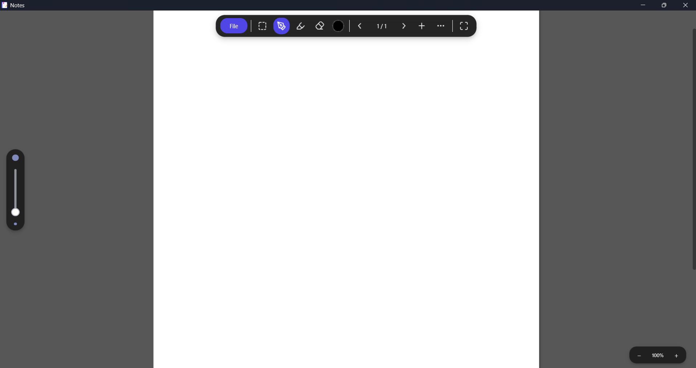
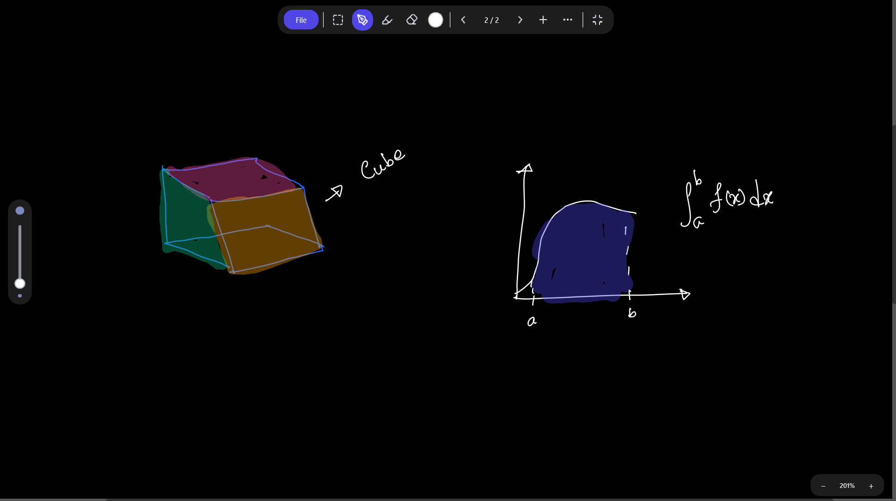

<div align="center">
  
  <h1>BetterNote</h1>
  <p>A minimal, distraction-free handwritten digital notebook for Windows & Linux.</p>


  <p>
    <a href="https://github.com/V151T0R/BetterNote/releases/tag/v1.0.0"></a>
    
    
    
    
  </p>
</div>

---


## Highlights

- **Natural Inking**: Smooth, pressure-sensitive vector pen & blended highlighter.
- **Essential Tools**: Pen, Highlighter, Eraser, and a Lasso Selection tool to move strokes.
- **Distraction-Free**: Floating frosted toolbars, calming desk background, and clean paper.
- **Your Notes, Yours**: Saves directly to lightweight `.json` files. No accounts, no clouds, 100% offline.
- **Exports**: Quick export to PDF or images (`.png`, `.jpg`) when you need to share.

---

## Preview

<div align="center">
  
  <p><em>Clean Workspace & Layout</em></p>
  
  <br/>
  
  
  <p><em>Freehand Inking & Dark Mode</em></p>
</div>

---

## Getting Started

### Option 1: Standalone Executable
Download **`BetterNote.exe`** from [Releases](https://github.com/V151T0R/BetterNote/releases/tag/v1.0.0) (or run `dist/BetterNote.exe`) and double-click to launch. No installation or Python required.

### Option 2: Run from Source
```bash
# Clone the repository
git clone https://github.com/V151T0R/BetterNote.git
cd BetterNote

# Install dependencies
pip install -r requirements.txt

# Launch application
python main.py
```

### Build Executable
- **Windows**: Double-click **`build.bat`** (or run `pyinstaller BetterNote.spec --noconfirm`).
- **Linux**: Run `./build_linux.sh` to package a binary and desktop launcher.

---

## Shortcuts

| Action | Shortcut |
| :--- | :--- |
| Pen Tool | <kbd>P</kbd> |
| Highlighter Tool | <kbd>H</kbd> |
| Eraser Tool | <kbd>E</kbd> |
| Lasso Selection Tool | <kbd>S</kbd> |
| Undo / Redo | <kbd>Ctrl</kbd> + <kbd>Z</kbd> / <kbd>Ctrl</kbd> + <kbd>Y</kbd> |
| Save / Open | <kbd>Ctrl</kbd> + <kbd>S</kbd> / <kbd>Ctrl</kbd> + <kbd>O</kbd> |
| Pan Canvas | <kbd>Space</kbd> + Drag |
| Zoom In / Out | <kbd>Ctrl</kbd> + <kbd>+</kbd> / <kbd>Ctrl</kbd> + <kbd>-</kbd> |
| Reset Zoom | <kbd>Ctrl</kbd> + <kbd>0</kbd> |
| Fullscreen | <kbd>F11</kbd> |

---

## Built With

- [](https://python.org)
- [-41CD52?style=flat-square&logo=qt&logoColor=white)](https://wiki.qt.io/Qt_for_Python)
- [](https://pyinstaller.org/)

---

<div align="center">
  <sub>Made for peaceful scribbling and sketching. Open source under the MIT License.</sub>
</div>
